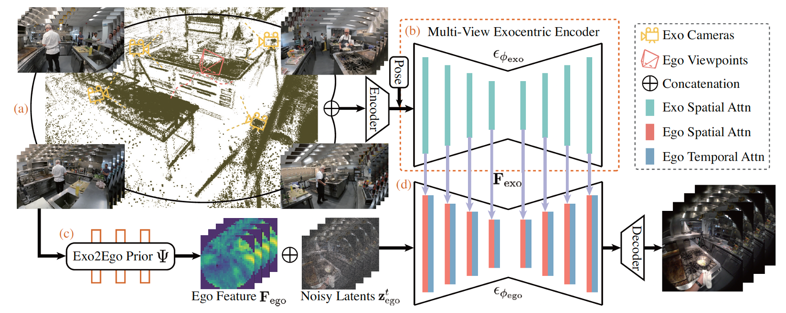

# [NeurIPS 2024] Exocentric-to-Egocentric Video Generation

  
This is the official repository of **Exo2Ego-V** [Paper](https://proceedings.neurips.cc/paper_files/paper/2024/file/f5a8b5e5d007e66c929b971c2bc21d76-Paper-Conference.pdf)

[Jia-Wei Liu*](https://jia-wei-liu.github.io/), [Weijia Mao*](https://scholar.google.com/citations?user=S7bGBmkyNtEC&hl=zh-CN),  [Zhongcong Xu](https://scholar.google.com/citations?user=-4iADzMAAAAJ&hl=en), [Jussi Keppo](https://www.jussikeppo.com/), [Mike Zheng Shou](https://sites.google.com/view/showlab)

> **TL;DR:** A novel exocentric-to-egocentric video generation method for challenging daily-life skilled human activities.


  

## 📝 Preparation

 
### Installation
```
git clone https://github.com/showlab/Exo2Ego-V.git
cd Exo2Ego-V
pip install -r requirements.txt
```

### Download Pre-Trained Weights
```shell
python tools/download_weights.py
```
Model weights should be placed under `./pretrained_weights`.


## 🚀 Ego-Exo4D Dataset

**Please refer to https://ego-exo4d-data.org/ for downloading the [Ego-Exo4D](https://arxiv.org/abs/2311.18259) dataset. Our experiments utilized the downscaled takes at 448px on the shortest side.**

### Data Processing -- Frames Extraction
Please modify the data and output directory in each script.
```shell
python scripts_preprocess/extract_frames_from_videos.py
```
### Data Processing -- Camera Poses
Please modify the data, input, and output directory in each script.
```shell
python scripts_preprocess/get_ego_pose.py
python scripts_preprocess/get_exo_pose.py
python scripts_preprocess/get_ego_intrinsics.py
```

## 🏋️‍️ Experiment

### Training
**Stage 1: Train Exo2Ego Spatial Appearance Generation.**
Please modify the data and pretrained model weights directory in configs/train/stage1.yaml
```bash
bash train_stage1.sh
```

**Stage 2: Train Exo2Ego Temporal Motion Video Generation.** 
Please modify the data, pretrained model weights, and stage 1 model weights directory in configs/train/stage2.yaml
```bash
bash train_stage2.sh
```

### Checkpoints
We release the 5 Pretrained Exo2Ego View Translation Prior checkpoints on [link](https://drive.google.com/drive/folders/1ha9cdVl1P0kSOIi0fqfImZI54sjd1dNJ?usp=sharing).

## 🎓 Citation

If you find our work helps, please cite our paper.

```bibtex
@article{liu2024exocentric,
  title={Exocentric-to-egocentric video generation},
  author={Liu, Jia-Wei and Mao, Weijia and Xu, Zhongcong and Keppo, Jussi and Shou, Mike Zheng},
  journal={Advances in Neural Information Processing Systems},
  volume={37},
  pages={136149--136172},
  year={2024}
}
```

## ✉️ Contact
This repo is maintained by [Jiawei Liu](https://jia-wei-liu.github.io/). Questions and discussions are welcome via jiawei.liu@u.nus.edu.

## 🙏 Acknowledgements
This codebase is based on [MagicAnimate](https://showlab.github.io/magicanimate/), [Moore-AnimateAnyone](https://github.com/MooreThreads/Moore-AnimateAnyone), and [PixelNeRF](https://github.com/sxyu/pixel-nerf). Thanks for open-sourcing!

## LICENSE
Copyright (c) 2025 Show Lab, National University of Singapore. All Rights Reserved. Licensed under the Apache License, Version 2.0 (see [LICENSE](https://github.com/showlab/Exo2Ego-V/blob/main/LICENSE) for details)